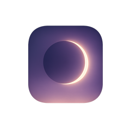
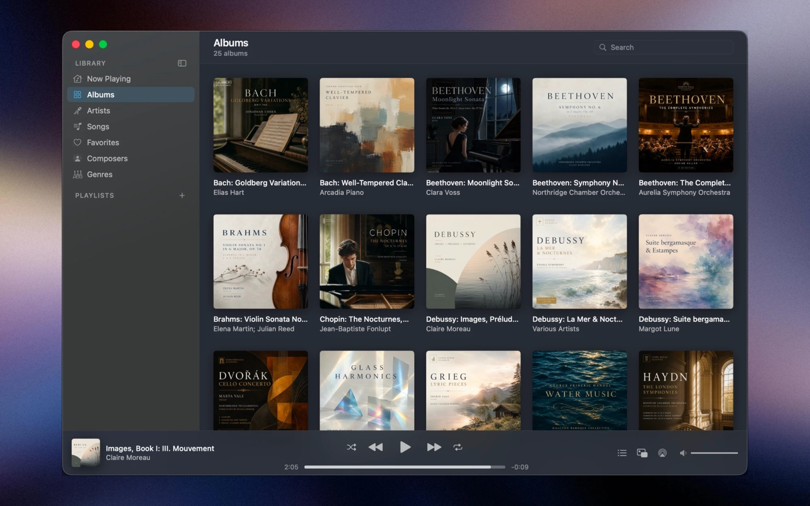
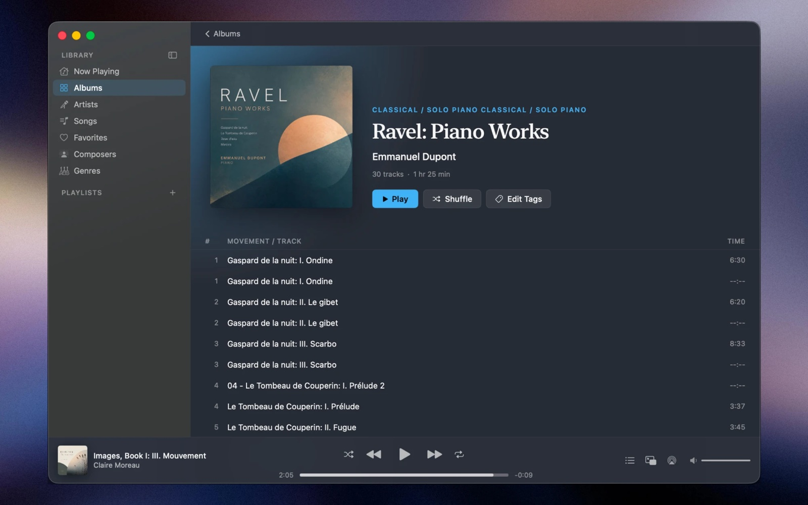

<p align="center">
  
</p>

<h1 align="center">Moonlight</h1>

<p align="center">
  <strong>A fast, beautiful music player for the music you own.</strong><br>
  Built for large libraries and classical collections, on Mac, iPhone and iPad.
</p>

<p align="center">
  <a href="https://apps.apple.com/us/app/moonlight-by-musopen/id6770145405?mt=12">Mac App Store</a> ·
  <a href="https://moonlightapp.org/">Website</a> ·
  <a href="https://www.reddit.com/r/moonlightapp/">Community</a>
</p>

<p align="center">
  <a href="LICENSE"></a>
  
  
</p>

<p align="center">
  
</p>

Moonlight is a music player for Mac, iPhone and iPad, made for people with large
music collections, including classical music. It plays the music files you
already own. It's not a streaming service. Your music stays on your devices.

Moonlight is made by [Musopen](https://musopen.org), a non-profit that makes
classical music free and accessible.

<p align="center">
  
</p>

## Features

- **Browse a large library quickly** by album, artist, song, composer and genre,
  with fast search across everything.
- **Classical-friendly.** Composers get their own view alongside artists.
- **Playlists and smart playlists.** Import and export M3U playlists, or build
  playlists that fill themselves from rules like rating, composer, genre or
  when you last played something.
- **Ratings and favorites** that sync between your Mac, iPhone and iPad through
  your own private iCloud account. Only this information syncs; your music
  files are never uploaded.
- **Internet radio** with a built-in directory of reviewed stations.
- **Last.fm scrobbling** (optional).
- **Themes and Now Playing scenes** to change how the player looks.
- **Tag editing** for common metadata fields.

Supported formats: MP3, AAC/M4A (including ALAC), FLAC, WAV and AIFF.

## Requirements

- macOS 14 Sonoma or later
- iOS / iPadOS 17 or later

## Privacy

Moonlight sends anonymous usage statistics to Google Analytics by default, and you
can turn this off in Settings > Privacy. Everything the app sends over the network
is listed in [PRIVACY.md](PRIVACY.md).

## How the code is organised

Every source file starts with a short plain-English note explaining what it
does. The main folders are:

| Folder | What's in it |
|---|---|
| `Sources/App` | App startup, the main window, menus and shared app state |
| `Sources/Database` | The local library database and iCloud sync |
| `Sources/Scanner` | Finding music files in your folders and reading their tags |
| `Sources/Playback` | Playing audio, the play queue and media keys |
| `Sources/Radio` | Internet radio |
| `Sources/LastFM` | Last.fm scrobbling |
| `Sources/UI` | Every screen and control you see in the Mac app |
| `Sources/Mobile` | The iPhone and iPad app |
| `Tests`, `MobileTests` | Automated tests |

Developers should also read [ARCHITECTURE.md](ARCHITECTURE.md) for a short technical overview.

## Building Moonlight yourself

You need a Mac with **Xcode 26 or later** and [XcodeGen](https://github.com/yonaskolb/XcodeGen).

```sh
brew install xcodegen
git clone https://github.com/musopen/moonlight.git
cd moonlight
xcodegen generate
open Moonlight.xcodeproj
```

The Xcode project is generated from `project.yml`, so edit that file (not the
`.xcodeproj`) and re-run `xcodegen generate` after changing it.

**Run the tests** without any Apple developer account:

```sh
xcodebuild test -project Moonlight.xcodeproj -scheme Moonlight -destination "platform=macOS" CODE_SIGNING_ALLOWED=NO
```

**To sign and run your own copy**, including iCloud sync:

1. Copy `Config/Signing.local.example.xcconfig` to `Config/Signing.local.xcconfig`.
2. Set your own Apple team ID, bundle ID and iCloud container in it. Git ignores
   this file.
3. Run `xcodegen generate` and build the `Moonlight` scheme in Xcode.

**Optional services** are off in your own builds unless you add your own keys:

- **Last.fm:** copy `Config/LastFMSecrets.example.xcconfig` to
  `Config/LastFMSecrets.local.xcconfig` and add an API key from
  [last.fm/api](https://www.last.fm/api/account/create).
- **Feedback form:** off unless you set your own endpoint; copy
  `Config/Feedback.local.example.xcconfig` to `Config/Feedback.local.xcconfig`.
- **Analytics:** builds without a `GoogleService-Info.plist` send no analytics.

## Contributing

Bug reports and pull requests are welcome. See [CONTRIBUTING.md](CONTRIBUTING.md).
To report a security problem, please follow [SECURITY.md](SECURITY.md) instead of
opening a public issue.

## License

Moonlight's source code is copyright Musopen and licensed under the
[Mozilla Public License 2.0](LICENSE). In short, you can use, change and share
it, including in other apps. If you distribute changes to Moonlight's own files,
those changed files must stay open source under the same license.

Some parts are not covered by Moonlight's license and keep their own terms:
third-party libraries, fonts, the Now Playing scene videos and the radio station
data. See [NOTICE](NOTICE) for the full list.

## Trademarks

"Moonlight" and the Moonlight app icon identify the official app published by
Musopen. They are not covered by the MPL. You're welcome to build, modify and
share your own version of this code, but if you distribute it, please give it a
different name and icon so people aren't confused about which app is which.
